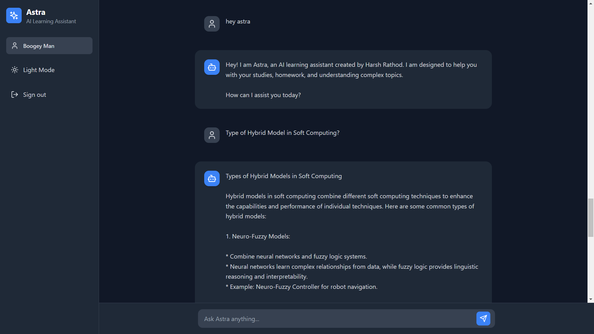

# Student Learning Assistant 🎓

A modern AI-powered learning companion built with React, Firebase, and Google's Gemini API. Get instant help with your studies, coding questions, and technical concepts! 🚀



## ✨ Features

🤖 AI-Powered Responses
- Real-time conversations with Google's Gemini AI
- Context-aware responses
- Code examples with syntax highlighting

🎨 Beautiful UI/UX
- Clean and modern interface
- Dark/Light theme support
- Responsive design for all devices

🔒 Secure Authentication
- Email/Password login
- Google sign-in
- Protected chat history

💾 Data Management
- Firebase real-time database
- Chat history persistence
- Export conversations to JSON

## 🛠️ Tech Stack

- ⚛️ React 18 with TypeScript
- 🎨 TailwindCSS for styling
- 🔥 Firebase Authentication & Firestore
- 🤖 Google Gemini AI API
- 🔷 Lucide React Icons
- ⚡ Vite for development

## 🚀 Getting Started

1. Clone the repository
   ```bash
   git clone https://github.com/harshrathod/Coding-Chat-bot.git
   ```
2. Install dependencies:
   ```bash
   npm install
   ```
3. Set up environment variables:
   ```env
   VITE_GEMINI_API_KEY=your_gemini_api_key
   VITE_FIREBASE_API_KEY=your_firebase_api_key
   VITE_FIREBASE_AUTH_DOMAIN=your_auth_domain
   VITE_FIREBASE_PROJECT_ID=your_project_id
   VITE_FIREBASE_STORAGE_BUCKET=your_storage_bucket
   VITE_FIREBASE_MESSAGING_SENDER_ID=your_sender_id
   VITE_FIREBASE_APP_ID=your_app_id
   ```
4. Start the development server:
   ```bash
   npm run dev
   ```

## 🌟 Key Features

### 🤝 Interactive Chat Interface
- Real-time message updates
- Code block support with syntax highlighting
- Markdown rendering
- Auto-scroll to latest messages

### 🎨 Theme Support
- Light/Dark mode toggle
- Theme persistence
- Smooth transitions
- Accessible color schemes

### 💾 Data Management
- Real-time chat synchronization
- Message history persistence
- Chat export functionality
- Clear chat option

### 🔒 Security
- Secure authentication
- Protected routes
- Firebase security rules
- API key protection

## 📱 Responsive Design

- Mobile-first approach
- Tablet & desktop optimized
- Flexible layouts
- Touch-friendly interface

## 🔧 Development

### Prerequisites
- Node.js 16+
- npm or yarn
- Firebase account
- Google Gemini API key

### Development Commands
```bash
# Start development server
npm run dev

# Build for production
npm run build

# Preview production build
npm run preview
```

## 🤝 Contributing

Contributions are welcome! Please feel free to submit a Pull Request.

## 📄 License

This project is licensed under the MIT License - see the [LICENSE](LICENSE) file for details.

## 👨‍💻 Author

**Harsh Rathod**

## 🙏 Acknowledgments

- Google Gemini API for AI capabilities
- Firebase team for the amazing backend services
- React community for the excellent ecosystem